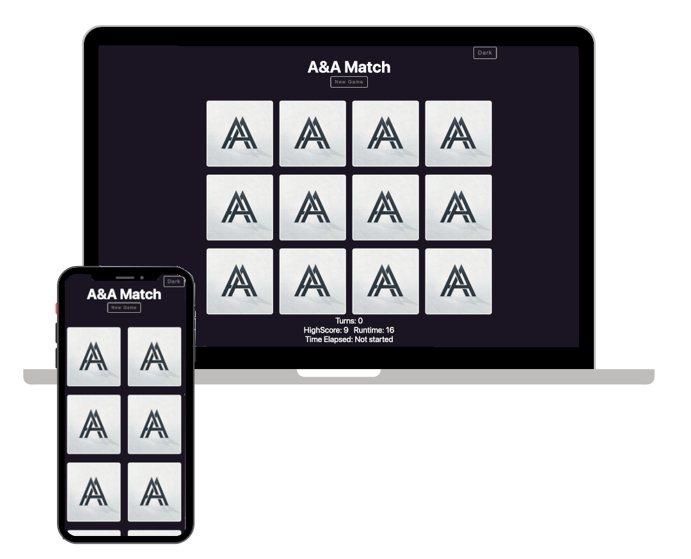

<h2 align="center">
   
  <a href="https://github.com/idna001" target="_blank">Andreas V</a>
</h2>

  

 

 &nbsp;

<h1 style="color: #01b0f2; text-align:center">Hacktoberfest 2025</h1>

<h1 style="color: #01b0f2; text-align:center">Improve a Memory in react js</h1>

## Open Tasks:

- [x] Fix Distorted images [@D3nn7](https://github.com/D3nn7)
- [x] Mobile Viewport fix 
- [x] Display always new Pictures, when restarting the game [@KingPaulus](https://github.com/KingPaulus)
- [x] Saving the Highscore in Local Storage [@bijanRegmi](https://github.com/BijanRegmi)
- [x] Add winning Alert Message with a celebrating sound [@needl3](https://github.com/needl3)
- [x] Add a sound by finding a match [@needl3](https://github.com/needl3)
- [x] Confetti Effect on Celebration 🎉 #45  [@SandeepKrSuman](https://github.com/SandeepKrSuman)
- [x] Count the time and show it next to the highscore, and in the Higscore Alert from [@needl3](https://github.com/needl3)
- [X] Build a Begin animation or sound #44 [@abhisheksharm-3](https://github.com/abhisheksharm-3)
- [x] Button, that makes a Screenshot of the Highscore to share it with friends [@insane-22](https://github.com/insane-22)
    - [ ] Functionality Buttons on default Overlay
    - [ ] Add API for Safari Share window
    - [ ] Fix listener preloading, at the moment it needs two clicks for opening
- [x] Add light and dark Mode theme [@Surajit0573](https://github.com/Surajit0573)
- [x] Animation on Pictures if they match #22 [@mohiwalla](https://github.com/mohiwalla)
- [x] Add runtime in Local Storage and show with High score [@barkha-gupta](https://github.com/barkha-gupta)
- [ ] Elimnate Sonar Cloud issues #96
- [ ] Add game history #50
- [ ] Add a View Counter #21
- [x] Make seperate Files optimize code maintability [@KingPaulus](https://github.com/KingPaulus)
- [ ] See the Issues Task, or open Pull Requests (they may need help or fixxes)
- [ ] Another Feature or Bug that's not here listed, but necessary

<!-- issueTable -->

<!-- issueTable -->

## How to contribute 

1. **Fork the repo** (optional)
2. **Clone the repository** to your local machine
3. **Create a new branch** for your changes
4. **Make your changes**:
    - Add your name to the credits
    - [Run the app](#run-the-app)
    - [Test your changes](#test)
5. **Push your changes** and create a Pull Request (PR)
6. **Wait for a review** and merge the PR
7. **Celebrate your first PR! 🎉**
8. **Repeat and keep contributing** ;)

###  How to run the App
1. **`npm install`**
    - Installs all dependencies required for the project.

2. **`npm start`**
    - Runs the app in development mode.

3. Open [http://localhost:3000](http://localhost:3000) in your browser to view the app.

The page will reload if you make edits.\
You will also see any lint errors in the console.

###  How to test your Change
- First on localhost while developing
- Then on the Vercel Link of your PR
    - Vercel will deploy your changes automatically to a new Link
    - You can find the Link in the PR
- Test mobile and Desktop Viewport

Have fun while celebrating Hacktober
 
Lets Hack!

Feel free to make PR and complete the readme with your changes

## Credits
Sound Effect from
<a href="https://pixabay.com/?utm_source=link-attribution&amp;utm_medium=referral&amp;utm_campaign=music&amp;utm_content=6826">Pixabay</a>
<a href="https://mixkit.co">Mixkit</a>
